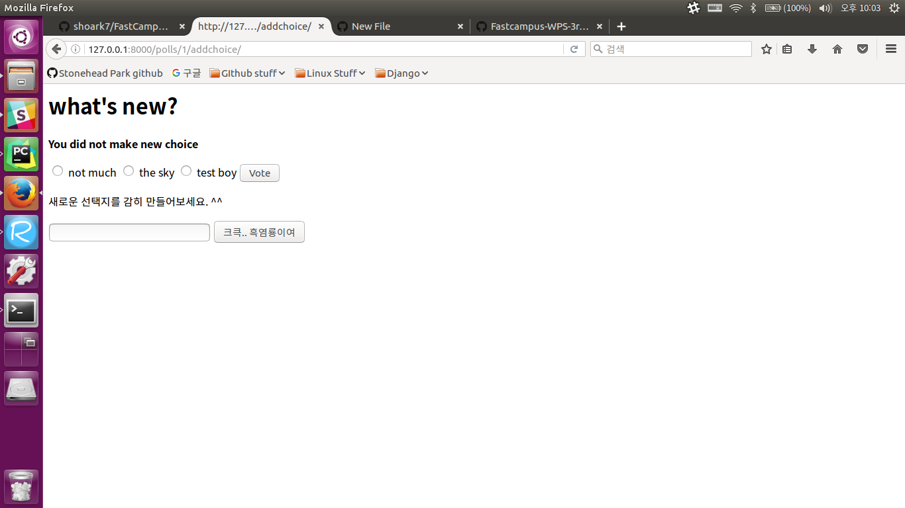
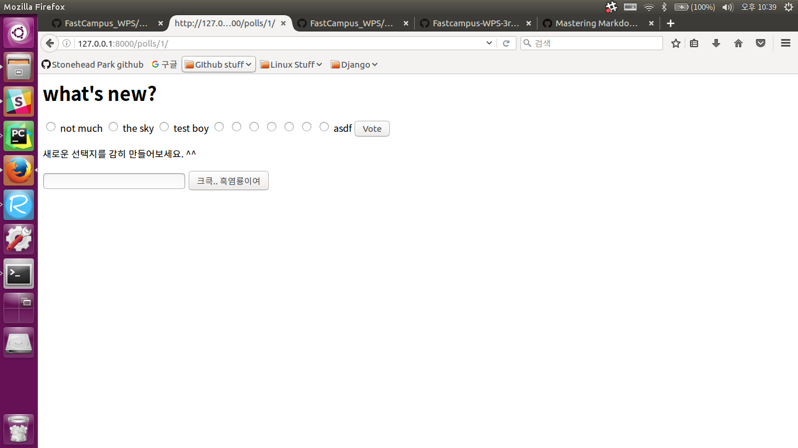

# 장고 튜토리얼 1~4 추가 기능 구현하기
<p style='text-align:center'>2016/10/06<br>박성환</p>
---

오늘 [장고 튜토리얼](https://docs.djangoproject.com/en/1.10/intro/) 1~4 챕터까지 다루었다.
오늘 숙제는 '사용자가 투표할 때 원하는 선택지도 만들 수 있도록 하자'였고 겨우 구현했다..


```python
# detail.html

<form action="" method="POST">
    
    <p>새로운 선택지를 감히 만들어보세요. ^^</p>
    <input type="text" name='new_name'>
    <button type="submit">크큭.. 흑염룡이여</button>
</form>

```
`detail.html`에 새로운 폼을 넣었다. 여기서 주목할 점은<br>
1. `` 을 처음에 안 넣었는데 바로 안 넣었다고 에러가 떴다.<br>
POST 폼에서 필수불가결로 필요하다면 장고는 왜 기본적으로 지원하지 않을까?<br>
사용자 귀찮게 이런 토큰이나 넣고.. 그냥 해주면 안 되나? 편의를 최대한 제공하겠다는 분들의 마인드답지않다. 선생님이 내일 알려주시기를 바라본다.<br>
2. `<input type="text" name='new_name'>` 여기서 처음에는 'value' 값까지 넣었는데 input 태그가 가질 수 있는 'name', 'value', 'text'속성들 중
어떤 속성이 키가 되고 어떤 속성이 value가 되는지 여기서 제일 헤맸다.<br>
'radio' 버튼 등과 달리 text타입은 **태그 안에 value가 드러나지 않고 사용자가 입력한 값이 비명시적으로 value로 들어오는 것 같다.**


```python
# view section
def add_new_choice(request, question_id):
    question = get_object_or_404(Question, pk=question_id)
    try:
        candidate = request.POST.get('new_name')
        if not candidate:
            raise KeyError
    except (KeyError, Choice.DoesNotExist):
        return render(request, 'detail.html', {'question': question,
                                               'error_message': 'You did not make new choice'})
    else:
        choices = question.choice_set.create(choice_text=candidate, votes=0)
        return HttpResponseRedirect(reverse('polls_name:detail', args=(question.id,)))
```

선택지를 추가하는 뷰를 `add_new_choice`라고 이름지었다.<br>
question_id를 받고 POST 요청으로 들어온 request 중 'new_name'이라는 이름을 가진 키의 값을 candidate안에 넣었다.<br>
아무 것도 입력 안 하고 추가를 누르는 불한당들을 막기 위해 에러 구문을 빌려 썼다.<br>
`choice_set`에서 `create` 함수를 통해 새로운 choice 레코드를 만들었는데, 그 text는 candidate로 셋했다.<br>
save를 안 해도 된다고 말씀하신 선생님의 가르침이 떠올라 3초 정도 즐거웠다.<br>
추가가 되면 다시 투표 페이지로 돌아와야 하기 때문에 `detail`로 redirect했다.<br><br>
한 가지 주목할 점은 `if not candidate: raise KeyError`, 원래는 아무것도 입력 안하고 추가를 누르면<br>
candidate이 비어있음에도 불구하고 choice가 빈 문자열로 생기는 현상을 발견했고 그래서 위와 같이 비어 있으면 에러가 나도록 명시했다.<br>
request의 키:값 중 값이 비어 있어도 오류가 나지 않는다는 가르침을 받았다.<br><br>

~~왠지 뿌듯하다..~~

처음 구현이 된 상황이다.<br>


빈 값에 대처하지 못해 공허한 구멍만이 숭숭 뚫린 모습이다.<br>


대처하는 코드를 만들었고 빈 값 입력시 위에 에러메시지가 나오게 된 상황이다.
